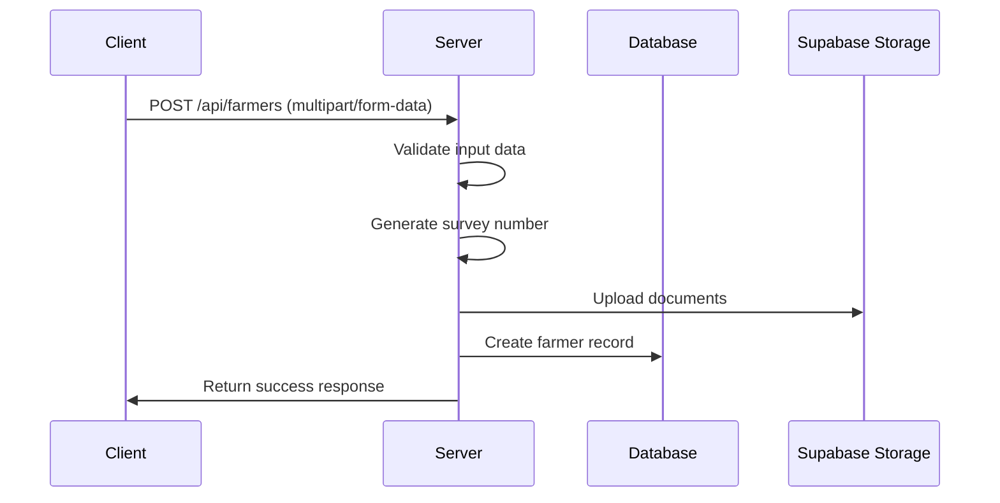
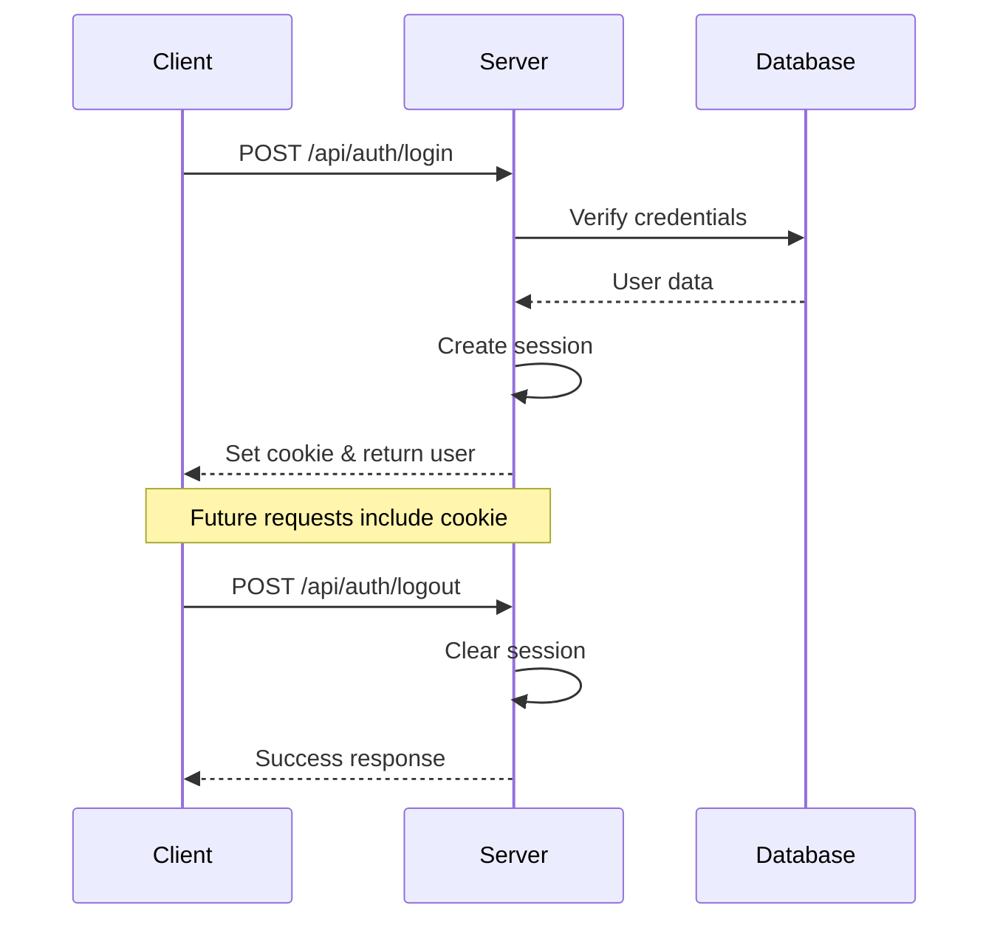
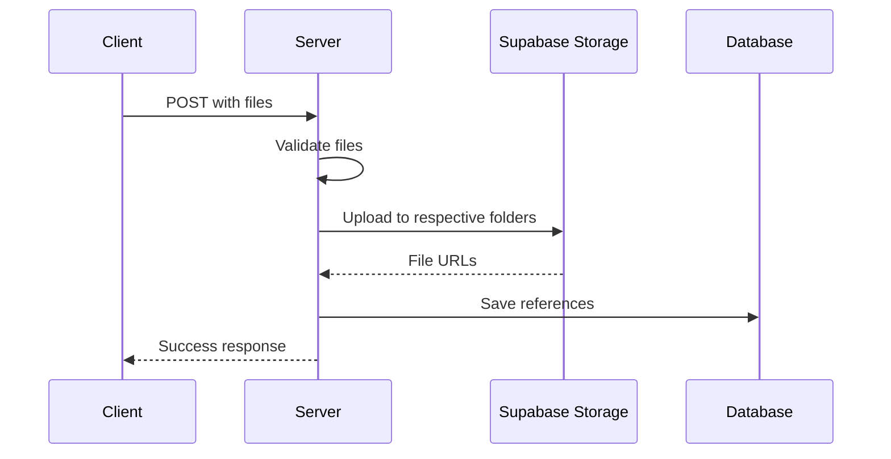

# Farmer Data Collection API Documentation

## Table of Contents

-  [Authentication](#authentication)
   -  [Login](#login)
   -  [Logout](#logout)
-  [User Management](#user-management)
   -  [Create Staff User](#create-staff-user)
   -  [List Users](#list-users)
   -  [Toggle User Status](#toggle-user-status)
-  [Farmer Management](#farmer-management)
   -  [Create Farmer](#create-farmer)
   -  [List Farmers](#list-farmers)
   -  [Get Single Farmer](#get-single-farmer)
   -  [Update Farmer](#update-farmer)
   -  [Delete Farmer](#delete-farmer)
-  [Document Management](#document-management)
   -  [Get Document URL](#get-document-url)
-  [Export Management](#export-management)
   -  [Export Farmers Data](#export-farmers-data)

## Authentication

### Login

`POST /api/auth/login`

Authenticates a user and creates a session.

**Request Body:**

```json
{
	"email": "admin@test.com",
	"password": "admin123"
}
```

**Response:**

```json
{
	"user": {
		"id": 1,
		"email": "admin@test.com",
		"name": "Admin User",
		"role": "ADMIN",
		"createdAt": "2024-01-21T..."
	}
}
```

**Notes:**

-  Sets an HTTP-only cookie with session information
-  Cookie expires in 7 days
-  Session includes userId and role

### Logout

`POST /api/auth/logout`

Ends the user session.

**Response:**

```json
{
	"message": "Logged out successfully"
}
```

**Notes:**

-  Clears the session cookie
-  No request body needed

## User Management

### Create Staff User

`POST /api/users`

Creates a new staff user (Admin only).

**Request Body:**

```json
{
	"email": "staff@example.com",
	"password": "staffpass",
	"name": "Staff Name"
}
```

**Response:**

```json
{
	"user": {
		"id": 2,
		"email": "staff@example.com",
		"name": "Staff Name",
		"role": "STAFF",
		"createdAt": "2024-01-21T..."
	}
}
```

**Notes:**

-  Only accessible by ADMIN users
-  Password is hashed before storage
-  Role is automatically set to STAFF

### List Users

`GET /api/users`

Lists all users (Admin only).

**Response:**

```json
{
	"users": [
		{
			"id": 1,
			"email": "admin@test.com",
			"name": "Admin User",
			"role": "ADMIN",
			"isActive": true,
			"createdAt": "2024-01-21T..."
		}
		// ...
	]
}
```

### Toggle User Status

`POST /api/users/{id}/toggle-status`

Activates or deactivates a user account (Admin only).

**Response:**

```json
{
	"message": "User activated/deactivated successfully",
	"user": {
		"id": 2,
		"email": "staff@example.com",
		"name": "Staff Name",
		"role": "STAFF",
		"isActive": false
	}
}
```

**Notes:**

-  Cannot deactivate the last admin user
-  Deactivated users cannot log in

## Farmer Management

### Create Farmer

`POST /api/farmers`

Creates a new farmer record with documents.

**Request Body:** Must be sent as `multipart/form-data`

```typescript
{
	// Personal Details
	farmerName: string;
	relationship: 'SELF' | 'SPOUSE' | 'CHILD' | 'OTHER';
	gender: 'MALE' | 'FEMALE' | 'OTHER';
	community: string;
	aadharNumber: string; // 12 digits
	contactNumber: string; // 10 digits

	// Location
	state: string;
	district: string;
	mandal: string;
	village: string;
	panchayath: string;

	// Dates
	dateOfBirth: string; // YYYY-MM-DD
	age: string;

	// Bank Details
	ifscCode: string;
	accountNumber: string;
	branchName: string;
	bankAddress: string;
	bankName: string;
	bankCode: string;

	// Fields (JSON string)
	fields: string; // Array of field objects

	// Files
	profilePic: File;
	aadharDoc: File;
	bankDoc: File;
	fieldDoc_0: File; // One for each field
}
```

**Response:**

```json
{
	"message": "Farmer created successfully",
	"farmer": {
		"id": 1,
		"surveyNumber": "ABCD1234567"
		// ... all farmer details
	}
}
```

**Flow:**



### List Farmers

`GET /api/farmers`

Lists farmers with pagination and filtering.

**Query Parameters:**

-  `page`: number (default: 1)
-  `limit`: number (default: 10)
-  `search`: string (optional)
-  `state`: string (optional)
-  `district`: string (optional)

**Response:**

```json
{
	"farmers": [
		{
			"id": 1,
			"surveyNumber": "ABCD1234567",
			"name": "Farmer Name"
			// ... other fields
		}
	],
	"pagination": {
		"total": 100,
		"pages": 10,
		"currentPage": 1,
		"limit": 10
	}
}
```

### Get Single Farmer

`GET /api/farmers/{identifier}`

Gets detailed information about a single farmer.

**Path Parameters:**

-  `identifier`: Survey number or farmer ID

**Response:**

```json
{
	"farmer": {
		"id": 1,
		"surveyNumber": "ABCD1234567",
		"name": "Farmer Name",
		"documents": {
			"profilePicSignedUrl": "...",
			"aadharDocSignedUrl": "...",
			"bankDocSignedUrl": "..."
		}
		// ... all details including fields
	}
}
```

### Update Farmer

`PUT /api/farmers/{identifier}`

Updates a farmer's information (Admin only).

**Path Parameters:**

-  `identifier`: Survey number or farmer ID

**Request Body:** Same as create farmer, all fields optional except files being updated.

**Response:**

```json
{
	"message": "Farmer updated successfully",
	"farmer": {
		// Updated farmer details
	}
}
```

### Delete Farmer

`DELETE /api/farmers/{identifier}`

Deletes a farmer and all associated data (Admin only).

**Path Parameters:**

-  `identifier`: Survey number or farmer ID

**Response:**

```json
{
	"message": "Farmer deleted successfully"
}
```

**Notes:**

-  Deletes all associated documents from storage
-  Cascading delete for all related records

## Document Management

### Get Document URL

`GET /api/documents/{type}/{id}/url`

Generates a signed URL for document viewing.

**Path Parameters:**

-  `type`: One of: profile-pic, aadhar, bank, land
-  `id`: Farmer ID

**Query Parameters:**

-  `fieldIndex`: number (required for land documents)

**Response:**

```json
{
	"url": "https://..." // 30-minute valid signed URL
}
```

## Export Management

### Export Farmers Data

`POST /api/export/farmers`

Exports farmer data in Excel or PDF format.

**Request Body:**

```json
{
  "options": {
    "format": "EXCEL" | "PDF",
    "range": "ALL" | "CURRENT_PAGE" | "CUSTOM_RANGE",
    "pageStart": number,
    "pageEnd": number,
    "limit": number
  }
}
```

**Response:**

```json
{
	"downloadUrl": "https://...", // 24-hour valid signed URL
	"exportedCount": 100
}
```

**Notes:**

-  Excel format includes all data in tabular form
-  PDF format includes formatted sections for each farmer
-  Document URLs in exports are valid for 7 days

## Error Handling

All endpoints follow this error response format:

```json
{
	"error": "Error message",
	"details": "Additional error details" // optional
}
```

Common HTTP Status Codes:

-  200: Success
-  400: Bad Request (validation errors)
-  401: Unauthorized (no session)
-  403: Forbidden (insufficient permissions)
-  404: Not Found
-  500: Internal Server Error

## Authentication Flow



## File Upload Flow


