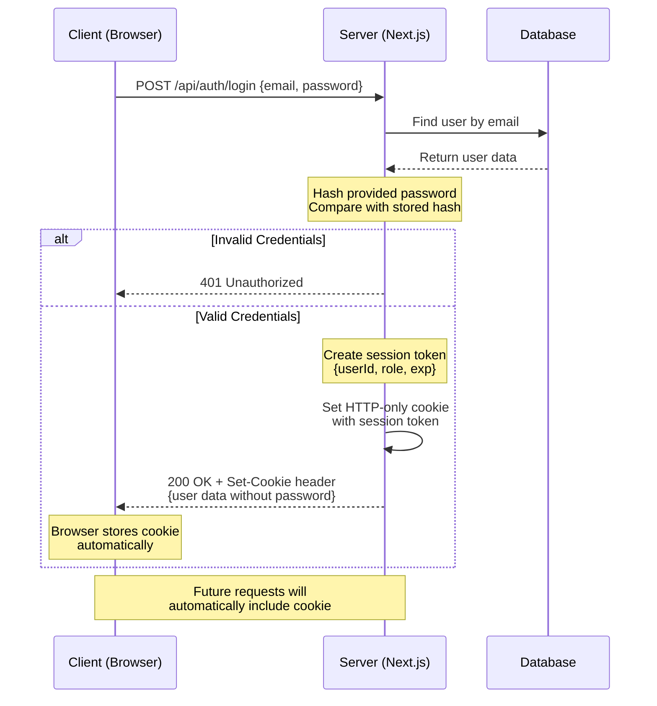

### Basic route structure

```
/api/
  /auth/
    /login
    /logout
  /farmers/
    /[id]     // GET, PUT, DELETE
    /create   // POST
    /list     // GET with pagination/filters
  /users/     // admin only
    /create
    /list
    /[id]
  /documents/
    /upload
    /download/[id]
```


